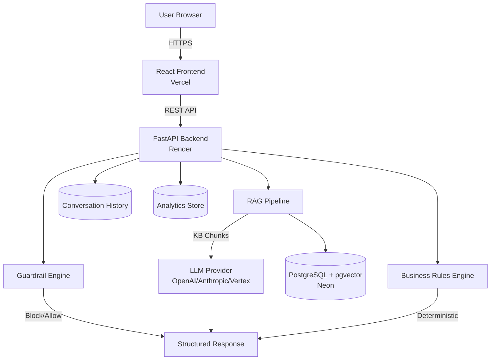
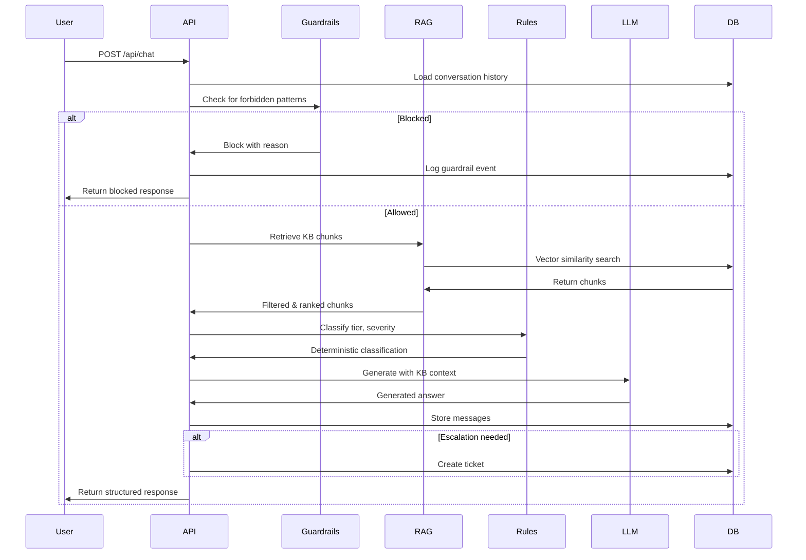

# AI Help Desk System Architecture

## Overview

The AI Help Desk is an enterprise-grade support system that provides KB-grounded responses with deterministic business logic, comprehensive safety guardrails, and real-time analytics.

## System Components



## Architecture Layers

### 1. API Layer (`app/api/`)

**Responsibility:** HTTP request handling and routing

- **FastAPI Routes**: RESTful endpoints for chat, tickets, and metrics
- **Dependencies**: Dependency injection for database, LLM, and embeddings
- **Validation**: Pydantic schemas for request/response validation

**Key Files:**
- `routes/chat.py` - Chat endpoint with mandatory execution order
- `routes/tickets.py` - Ticket management
- `routes/metrics.py` - Analytics and metrics

### 2. Core Business Logic (`app/core/`)

**Responsibility:** Deterministic classification and safety

- **Guardrails** (`guardrails.py`): Pure Python pattern matching for forbidden actions
- **Tiering** (`tiering.py`): Rule-based tier classification (TIER_0 to TIER_3)
- **Severity** (`severity.py`): Rule-based severity classification (LOW to CRITICAL)
- **Escalation** (`escalation.py`): Deterministic escalation logic

**Design Principles:**
- **NO LLM involvement** in business decisions
- **Deterministic**: Same input → same output
- **Rule-based**: Explicit if/else logic, no ML models

### 3. RAG Pipeline (`app/rag/`)

**Responsibility:** Knowledge retrieval and ranking

- **Ingestion** (`ingestion.py`): Parse markdown, chunk by headings, extract metadata
- **Embeddings** (`embeddings.py`): Sentence Transformers for vector generation
- **Retrieval** (`retrieval.py`): Vector similarity search with pgvector
- **Ranking** (`ranking.py`): Conflict resolution (version/date preference), role filtering

**Chunking Strategy:**
- Split by markdown headings (##, ###)
- Preserve metadata with each chunk
- Max chunk size: 1000 characters

**Conflict Resolution:**
1. Compare version numbers (higher wins)
2. Compare last_updated dates (newer wins)
3. Explicitly state which document is authoritative

### 4. LLM Abstraction (`app/llm/`)

**Responsibility:** Provider-agnostic LLM interface

- **Provider** (`provider.py`): Abstract base class with implementations for:
  - OpenAI (GPT-4)
  - Anthropic (Claude)
  - Vertex AI (Gemini)
  - Mock (for testing)
- **Prompt Builder** (`prompt_builder.py`): Constructs system prompts with KB context

**LLM Configuration:**
- **Temperature**: 0.0 (deterministic)
- **Max Tokens**: 1000
- **System Prompt**: Enforces KB-only grounding

### 5. Database Layer (`app/db/`)

**Responsibility:** Data persistence and access

- **Models** (`models.py`): SQLAlchemy ORM models
- **Repositories** (`repositories.py`): Repository pattern for clean data access
- **Connection** (`connection.py`): Async connection pool management

**Database Schema:**

```
kb_documents
├── id (PK)
├── title
├── version
├── last_updated
└── tags

kb_chunks
├── id (PK)
├── kb_document_id (FK)
├── chunk_text
├── heading_path
├── embedding (vector(384))
└── chunk_index

conversations
├── session_id (PK)
├── user_role
└── created_at

messages
├── id (PK)
├── session_id (FK)
├── role
├── content
└── timestamp

tickets
├── id (PK)
├── session_id (FK)
├── tier
├── severity
├── subject
└── description

guardrail_events
├── id (PK)
├── session_id (FK)
├── trigger_type
├── blocked
└── timestamp

analytics_events
├── id (PK)
├── event_type
├── session_id (FK)
└── metadata (JSONB)
```

## Data Flow

### Chat Request Processing



### Mandatory Execution Order

The chat API **MUST** follow this exact order:

1. **Validate** request (Pydantic)
2. **Load** conversation history
3. **Run** guardrail checks
4. **Retrieve** KB chunks
5. **Check** KB coverage
6. **Compute** tier, severity, escalation (rule-based)
7. **Generate** answer using ONLY KB content
8. **Store** conversation
9. **Return** structured response

**Never bypass this order.**

## Technology Stack

### Backend
- **Framework**: FastAPI 0.109.0
- **Language**: Python 3.11
- **Database**: PostgreSQL with pgvector
- **ORM**: SQLAlchemy 2.0 (async)
- **Embeddings**: Sentence Transformers (all-MiniLM-L6-v2)
- **LLM**: OpenAI / Anthropic / Vertex AI (configurable)

### Frontend
- **Framework**: React 19 + Vite
- **UI Library**: Material-UI (MUI)
- **Routing**: React Router
- **State**: React Context API

### Infrastructure
- **Backend Hosting**: Render (Docker)
- **Frontend Hosting**: Vercel
- **Database**: Neon (serverless PostgreSQL)
- **Vector Store**: pgvector extension

## Security & Safety

### Guardrails

**Forbidden Actions:**
- Host/hypervisor access
- Disabling logging/monitoring
- Kernel debugging
- Editing `/etc/hosts`
- Destructive system-wide operations

**Response:**
- Immediate block
- Polite refusal (no technical details)
- Event logging
- Escalation if HIGH/CRITICAL severity

### Role-Based Access Control

- **Trainees/Instructors**: No OS-level commands
- **Operators/Support**: High-level guidance only
- **Admins**: Full access (with logging)

### KB Grounding

- LLM receives ONLY retrieved KB chunks
- System prompt explicitly forbids external knowledge
- If no KB chunks → explicit "not in KB" response
- All answers must cite KB document IDs

## Scalability Considerations

### Current Design
- Async I/O throughout (FastAPI + asyncpg)
- Connection pooling for database
- Stateless API (horizontally scalable)
- Sentence Transformers loaded once (singleton)

### Future Optimizations
- **Caching**: Redis for KB chunks and embeddings
- **CDN**: Static assets and frontend
- **Load Balancing**: Multiple backend instances
- **Read Replicas**: For analytics queries
- **Batch Processing**: Async KB ingestion

## Monitoring & Observability

### Metrics Tracked
- Deflection rate (TIER_0 / total)
- Tickets by tier and severity
- Guardrail activations
- Escalation counts
- Conversation volumes
- Response times

### Logging
- Structured logging (JSON)
- Log levels: DEBUG, INFO, WARNING, ERROR
- Correlation IDs for request tracing
- Guardrail events logged separately

## Offline-Ready Architecture

The system is designed to run in no-internet environments:

1. **Sentence Transformers**: No API dependency
2. **Local Vector Store**: PostgreSQL + pgvector
3. **Abstract LLM Interface**: Swap for self-hosted models
4. **KB Files**: Local markdown files

To run offline:
- Replace LLM provider with self-hosted model (e.g., Llama, Mistral)
- Use local embedding model
- No external API calls required

## Design Decisions

### Why Sentence Transformers?
- Fast inference
- No API costs
- Works offline
- Good quality for 384-dimensional embeddings

### Why PostgreSQL + pgvector?
- Single database for all data
- Native vector operations
- ACID guarantees
- Mature ecosystem

### Why Deterministic Business Logic?
- Predictable behavior
- Easier testing
- Compliance requirements
- No ML bias in critical decisions

### Why Temperature 0.0?
- Reproducible outputs
- Deterministic responses
- Easier debugging
- Consistent user experience

## Future Enhancements

1. **Multi-language Support**: Translate KB and responses
2. **Voice Interface**: Speech-to-text integration
3. **Advanced Analytics**: ML-based issue prediction
4. **Auto-KB Updates**: Sync from external sources
5. **A/B Testing**: Compare LLM providers
6. **Fine-tuning**: Custom models for domain-specific tasks
